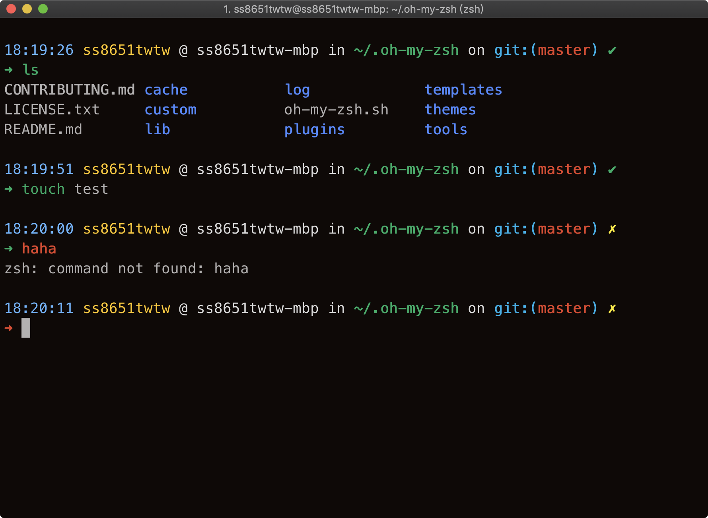

# ys.zsh-theme

Yet another [oh-my-zsh](https://github.com/robbyrussell/oh-my-zsh) theme based on [ys.zsh-theme](https://gist.github.com/ysmood/6110461).



## Installation

Just clone this repository into your OMZ `custom/themes` directory.

```
git clone https://github.com/ss8651twtw/ys.zsh-theme.git ~/.oh-my-zsh/custom/themes/ys.zsh-theme
```

And then select this theme in your `~/.zshrc`

```
ZSH_THEME="ys.zsh-theme/ys"
```
